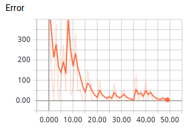
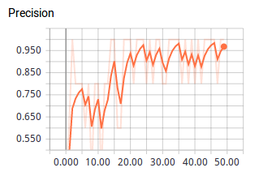
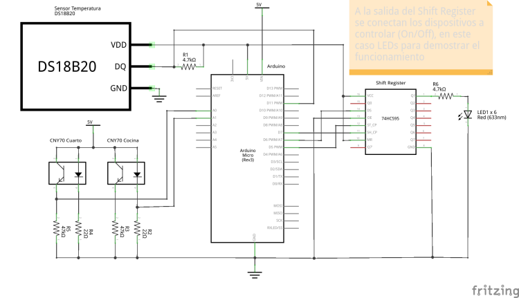

# Neuralog 

Click para ver el Video

[](https://www.youtube.com/watch?v=L-YZDdAM1cM)

Sistema de control domótico. Permite interactuar con dispositivos de la casa mediante una interfaz gráfica en PyQt4 y comandos de voz que son procesados por 
una red neuronal en Tensorflow, toda la información se encuentra en una base de conocimiento en SWI-Prolog.

Este proyecto hace uso de las siguientes herramientas/librerías:
- Webcam
- Arduino
	- Arduino Micro
	- Arduino IDE
	- Sensor de temperatura DS18B20
	- C.I 74HC595 (Registro de corrimiento)
	- LEDs
	- Librería OneWire
	- Librería DallasTemperature
- SWI-Prolog
- Espeak
- Python
	- Python 3.4
	- PySerial (Comunicación serial con Arduino)
	- Speake3 (Espeak)
	- PySWIP (Permite interactuar con el interprete de Prolog)
	- PyQt4 (Interfaz gráfica)
	- Tensorflow (Red Neuronal)
	- LibROSA (Procesamiento de Audio)
	- SciPy, Numpy y Pandas

El modelo usado es un clasificador. Se introducen 2600 Mel-frequency cepstral coefficients extraídos de 3 segundos de audio, solo dos clases de 
salida (Sí/No), dos capas ocultas; la primera tiene 1800 neuronas y la segunda 500.

La red se entrenó con un dropout de 75%, factor de aprendizaje de 0.0001 usando Adam Optimizer y tomando sets de 5 muestras (mini batch) hasta completar 
todo los datos (1 época), el proceso se repitió por por 50 épocas.

Al final la red quedo sobre entrenada pero mostró buenos resultados con los datos de prueba que no había visto la red, aún así tengo que pronunciar las palabras 
de forma parecida a las muestras para que sean mejor reconocidas.





Más información sobre el funcionamiento de la red y los Mel-frequency cepstral coefficients en [este Jupyter Notebook (Info/RedNeuronal.ipynb)](Info/RedNeuronal.ipynb)

----------------------------------------------------------------------------------

## 1. Instalar entorno virtual

> (!) Esta guía se creo para ser utilizada en Debian o Raspbian Jessie y posiblemente Ubuntu (No lo probé)
> (!) Puedes utilizar apt-get en lugar de aptitude (gusto personal)

### Instalar Python 3.4, pip y venv

- Pip es el gestor de paquetes oficial de python (librerías)
- Venv permite instalar paquetes para python en un entorno aislado sin interferir con las librerías del sistema

```bash
sudo aptitude install python3 python3-pip python3-dev python3-venv
```

### Crear un entorno virtual para nuestro proyecto
```bash
mkdir ~/venvs
mkdir ~/venvs/ProyectoFinalv
python3 -m ~/venvs/ProyectoFinalv
```

### Activamos el entorno
```bash
source ~/venvs/ProyectoFinal/bin/activate
```

### Actualizar pip
```bash
pip install -U pip
```

### Instalar herramientas para pip
```bash
pip install -U setuptools
```

### Si queremos salir
```bash
deactivate
```

> (!) A partir de ahora todos los comandos se ejecutaran en el entorno virtual, por lo que podemos usar pip y python en lugar de pip3 o python3

> *Referencias:*
> - https://www.digitalocean.com/community/tutorials/how-to-install-python-3-and-set-up-a-local-programming-environment-on-debian-8

------------------------------------------------------------------------------------

## 2. Configurar 

### a) Paso por paso
Los "componentes" se encuentran separados en carpetas y dentro de cada carpeta se encuentra un README con las instrucciones 
necesarias para instalar las herramientas necesarias y/o hacer modificaciones.

### b) Camino corto (Solo 64-bits)

Instalar los paquetes necesarios
```bash
sudo aptitude install arduino espeak python3-pyqt4 swi-prolog install pkg-config libpng-dev libfreetype6-dev portaudio19-dev
ln -s /usr/lib/python3/dist-packages/sip.cpython-34m-x86_64-linux-gnu.so ~/venvs/ProyectoFinal/lib/python3.4/site-packages/
```

Instalar las librerias para Python
```bash
pip install pyserial speake3 pyswip_alt numpy==1.12.1 scipy==0.19.0 matplotlib==2.0.0 jupyter==1.0.0 pandas==0.20.1 pip install pyaudio==0.2.11 librosa==0.5.1 tensorflow==1.1.0
```

> (!) Para una lista detallada consultar el archivo requeriments.txt (resultado del comando pip freeze) por lo que se podría usar el siguiente comando para tener un entornoidéntico:
> pip install -r requeriments.txt 

------------------------------------------------------------------------------------

## 3. Hardware

- Clonamos el repositorio o descargamos el ZIP

- Nos dirigimos a la carpeta de Neuralog
```bash
cd Neuralog
```
- Abrimos Arduino IDE y cargamos el sketch *Arduino/control_serial.ino*

- Conectamos el Arduino, compilamos y grabamos

Yo utilizo un Arduino Micro conectado de la siguiente forma



Para adaptarlo a otro hay que editar el sketch que se encuentra en *Arduino/control_serial.ino* y cambiar la placa y los pines a los que se conectan los componentes.

- Nos dirigimos a la carpeta de Neuralog y editamos el archivo *Neuralog.py* en la parte de CONSTANTES editar la variable PUERTO de acuerdo
al puerto en que tenemos conectado el arduino.

Si no sabes cual es el Arduino puedes revisar en el IDE en *Tool > Serial Port* o ejecutar el siguiente comando
```bash
ls /dev | grep ttyACM*
```

------------------------------------------------------------------------------------

## 4. Ejecutar Neuralog

- Activamos el entorno
```bash
source ~/venvs/ProyectoFinal/bin/activate
```

- Ejecutamos la interfaz
```bash
cd Neuralog
python Neuralog.py
```
